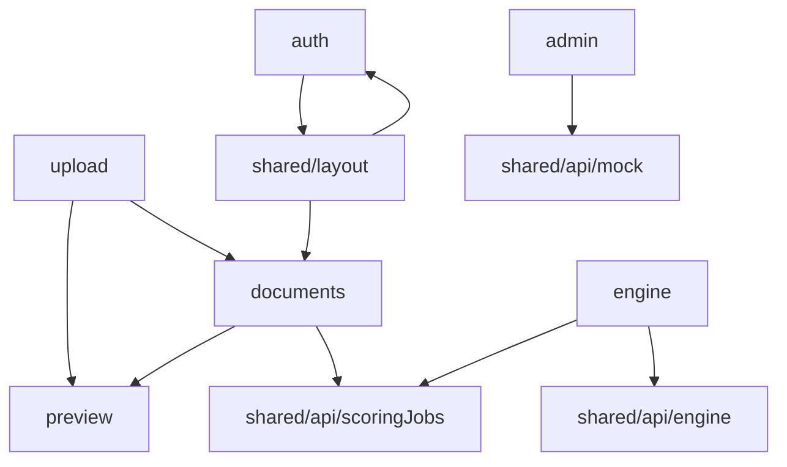

# 11 — Panduan Per Fitur

Referensi detail untuk mengedit setiap fitur existing — file mana, alur apa, dan apa yang bisa diubah.

---

## 1. Auth (Login & Session)

**Folder:** `src/features/auth/`

### Alur

```
User buka /login
  → isi email/password
  → useAuthStore.login()
  → authApi (mock atau real)
  → token → localStorage
  → redirect ke /upload
```

### File & apa yang bisa diubah

| File | Ubah untuk |
|------|------------|
| `pages/LoginPage.js` | Layout form, placeholder, pesan error UI |
| `store/useAuthStore.js` | Logic login/logout, field state tambahan |
| `api/authApi.js` | Endpoint, format request/response |
| `components/ProtectedRoute.js` | Spinner loading, redirect behavior |
| `components/AdminRoute.js` | Role yang diizinkan, redirect fallback |
| `shared/api/mock/authMock.js` | User/password mock |

Detail auth: [10-autentikasi-dan-hak-akses.md](./10-autentikasi-dan-hak-akses.md)

---

## 2. Upload (Unggah Dokumen)

**Folder:** `src/features/upload/`
**Route:** `/upload`

### Alur

```
User drag & drop file
  → UploadDropzone validasi tipe file (PDF/DOCX)
  → useUploadStore.setSelectedFiles()
  → Validasi ukuran per file ≤ 20 MB
  → User klik Upload
  → uploadFiles() → queue per file
  → POST /scoring-jobs/upload + progress bar
  → Toast sukses
  → Refresh antrian via useDocumentStore
```

### File & apa yang bisa diubah

| File | Ubah untuk |
|------|------------|
| `pages/UploadPage.js` | Judul, deskripsi halaman |
| `components/UploadArea.js` | Layout area upload, tombol utama |
| `components/UploadDropzone.js` | Teks drag-drop, accept file types |
| `components/SelectedFilesList.js` | Daftar file, tombol preview/hapus |
| `store/useUploadStore.js` | Logic queue upload, retry, progress |
| `constants.js` | Pesan error spesifik upload |

### Konstanta terkait

| File | Isi |
|------|-----|
| `shared/constants/upload.js` | `MAX_FILE_UPLOAD_BYTES` (20 MB) |
| `shared/constants/fileTypes.js` | MIME PDF & DOCX |

### Preview sebelum upload

Tombol preview di `SelectedFilesList` → `openLocalFilePreview` → tab `/preview/:previewId`

### Yang tidak boleh diubah sembarangan

- Nama field FormData harus tetap `files` (kontrak middleware)
- Upload tidak menunggu engine selesai — hanya konfirmasi terima file

---

## 3. Preview File

**Folder:** `src/features/preview/`

### Dua mode preview

| Mode | Route | Sumber file |
|------|-------|-------------|
| Lokal | `/preview/:previewId` | Session in-memory (`previewSession.js`) |
| Server | `/preview/document/:documentId` | `GET /scoring-jobs/{id}/file` |

### File & apa yang bisa diubah

| File | Ubah untuk |
|------|------------|
| `pages/FilePreviewPage.js` | Toolbar, layout viewer PDF/DOCX |
| `utils/previewSession.js` | TTL session, kapasitas memory |
| `utils/openLocalFilePreview.js` | Cara buka tab baru |
| `utils/downloadPreviewFile.js` | Unduh dari session lokal |

### Preview file ter-upload

Trigger dari `DocumentDetailModal` → `openUploadedDocumentPreview.js` di fitur documents.

### Library

- PDF: render via `<iframe>` + blob URL
- DOCX: `docx-preview` render ke div

---

## 4. Documents — Antrian

**Folder:** `src/features/documents/`
**Route:** `/queue`

### Alur

```
QueuePage mount
  → fetchQueueDocuments() + fetchProcessedDocuments()
  → GET /scoring-jobs?status=uploading,uploaded,waiting,running
  → DocumentTable variant="queue"
  → DocumentWatcher polling setiap 5 detik (jika ada pending)
```

### File & apa yang bisa diubah

| File | Ubah untuk |
|------|------------|
| `pages/QueuePage.js` | Header, tombol Muat Ulang |
| `components/DocumentTable.js` | Kolom, aksi per baris |
| `components/DocumentDetailModal.js` | Field metadata, tombol preview |
| `components/ClearAllDocumentsButton.js` | Konfirmasi hapus semua |
| `components/DocumentWatcher.js` | Interval polling |
| `constants.js` | `DOCUMENT_POLL_INTERVAL_MS` (default 5000) |
| `store/useDocumentStore.js` | Fetch, cancel, pagination |
| `utils/documentDetailFields.js` | Field yang ditampil di modal |

### Aksi per baris

| Tombol | API |
|--------|-----|
| Hapus | `POST /scoring-jobs/{id}/cancel` |
| Klik nama file | Buka `DocumentDetailModal` |

### Hapus Semua

Hanya membatalkan job **aktif** di antrian — tidak menghapus dokumen selesai/gagal.

---

## 5. Documents — Selesai

**Route:** `/processed`

### Alur

```
ProcessedPage mount
  → fetchProcessedDocuments()
  → GET /scoring-jobs?status=completed_success,failed
  → DocumentTable variant="processed"
```

### Aksi per status

| Status | Tombol | Destinasi |
|--------|--------|-----------|
| `done` (sukses) | Lihat Hasil | `/processed/:id` |
| `failed` (gagal) | Lihat Detail | Modal `DocumentDetailModal` + `failureReason` |

### File utama

Sama dengan antrian — `ProcessedPage.js` + `DocumentTable.js`.

Filter status: `middlewareContract.js` → `UI_PAGE_FILTERS.processed`

---

## 6. Documents — Detail Hasil Skor

**Route:** `/processed/:id`

### Alur

```
ProcessedDetailPage mount
  → fetchDocumentResult(id) dari useParams
  → GET /scoring-jobs/{id}
  → Render ScoreSummary + ResultsTable + TidakDapatDihitungPanel
  → Tombol Pratinjau PDF / Unduh PDF
```

### File & apa yang bisa diubah

| File | Ubah untuk |
|------|------------|
| `pages/ProcessedDetailPage.js` | Layout halaman, tombol kembali |
| `components/results/ScoreSummary.js` | Ringkasan skor & predikat |
| `components/results/ResultsTable.js` | Tabel detail komponen |
| `components/results/TidakDapatDihitungPanel.js` | Panel aspek Manajemen |
| `components/DownloadResultPdfButton.js` | Trigger generate PDF |
| `components/ResultPdfPreviewModal.js` | Modal iframe PDF |
| `utils/generateResultPdf.js` | Layout & isi PDF |

### Data hasil skor

Berasal dari mapper → field `result` di `documentResult` store.

Normalizer: `shared/utils/resultDetail.js`

---

## 7. Engine Dashboard (Admin)

**Folder:** `src/features/engine/`
**Route:** `/engine`

### Alur

```
EngineDashboardPage mount
  → engineApi.fetchEngineDashboard()
  → GET /engine/status + agregat GET /scoring-jobs
  → engineStatusMapper + buildEngineStatusFromDocuments (fallback)
  → Render ClusterStatusPanel, EngineStatsGrid, WorkerSection, RecentActivityList
```

### File & apa yang bisa diubah

| File | Ubah untuk |
|------|------------|
| `pages/EngineDashboardPage.js` | Layout dashboard, refresh |
| `api/engineApi.js` | Agregasi data |
| `api/mapDocumentsToEngineStatus.js` | Fallback dari scoring jobs |
| `components/ClusterStatusPanel.js` | Status cluster |
| `components/EngineStatsGrid.js` | Kartu statistik |
| `components/WorkerSection.js` | Tabel worker |
| `components/RecentActivityList.js` | Aktivitas terbaru |
| `utils/buildEngineStatusFromDocuments.js` | Fallback jika `/engine/status` gagal |

### Shared mapper

`shared/api/engine/engineStatusApi.js`
`shared/api/engine/engineStatusMapper.js`

### Label status

`shared/utils/engineStatusLabels.js` via facade `clusterStatus.js` / `workerStatus.js`

---

## 8. Admin — Aktivitas Pengguna

**Folder:** `src/features/admin/`
**Route:** `/admin/activity`

### Alur

```
UserActivityPage mount
  → adminApi.getOverview() (mock jika VITE_USE_MOCK_ADMIN=true)
  → UserStatsTable + ActivityLogTable
```

### File & apa yang bisa diubah

| File | Ubah untuk |
|------|------------|
| `pages/UserActivityPage.js` | Layout halaman |
| `api/adminApi.js` | Switch mock/real |
| `components/UserStatsTable.js` | Kolom statistik user |
| `components/ActivityLogTable.js` | Log aktivitas |
| `utils/badges.js` | Badge tipe aktivitas |
| `shared/api/mock/adminMock.js` | Data mock |
| `shared/api/mock/activityMock.js` | Log mock |

---

## 9. Layout & Navigasi Global

**Folder:** `src/shared/layout/`

| Komponen | Fungsi |
|----------|--------|
| `MainLayout.js` | Sidebar + konten + watcher + toast |
| `Sidebar.js` | Menu navigasi |
| `UserMenu.js` | Avatar/nama user, logout |

`DocumentWatcher` di-mount di `MainLayout` — berjalan di semua halaman user yang login.

---

## 10. Shared — Polling & Notifikasi

### DocumentWatcher

- Interval: `DOCUMENT_POLL_INTERVAL_MS` = 5000 ms
- Hanya poll saat `hasPendingDocuments === true`
- Hanya saat tab visible (`document.visibilityState`)
- Deteksi perubahan status → toast via `useUiStore`

### Mengubah pesan toast

Cari string toast di `useDocumentStore.js` (action `checkDocumentStatusUpdates` atau `syncFromPolling`).

---

## Diagram Ketergantungan Fitur



---

## Matriks: "Saya Mau Ubah X di Fitur Y"

| Keinginan | Fitur | File pertama yang dibuka |
|-----------|-------|--------------------------|
| Ubah progress bar upload | upload | `useUploadStore.js` |
| Ubah format tabel antrian | documents | `DocumentTable.js` |
| Ubah field modal detail | documents | `documentDetailFields.js` |
| Ubah isi PDF hasil | documents | `generateResultPdf.js` |
| Ubah warna badge status | shared | `documentStatusLabels.js` |
| Ubah interval auto-refresh | documents | `constants.js` → `DOCUMENT_POLL_INTERVAL_MS` |
| Ubah kartu statistik engine | engine | `EngineStatsGrid.js` |
| Ubah data mock login | auth | `authMock.js` |
| Ubah menu navigasi | shared | `Sidebar.js` |

---

## Langkah Berikutnya

- Checklist sebelum selesai → [12-checklist-sebelum-commit.md](./12-checklist-sebelum-commit.md)
- Masalah umum → [13-troubleshooting.md](./13-troubleshooting.md)